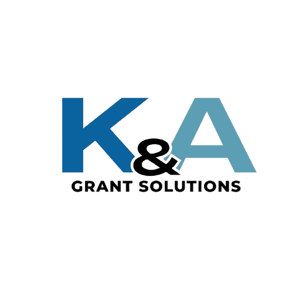

#+title: K&A Grant Solutions
#+SETUPFILE: https://fniessen.github.io/org-html-themes/org/setup/html-theme-bigblow.setup
#+OPTIONS: num:nil
#+HTML_HEAD: 
#+HTML_HEAD: <meta name="viewport" content="width=device-width, initial-scale=1.0">
#+HTML_HEAD: 
#+HTML_HEAD: 
#+HTML_HEAD: 
#+HTML_HEAD: 
* Home
#+ATTR_HTML: :style align: center; width: 50%; height: auto

#+ATTR_HTML: :style text-align: left !important;
Through a range of grant writing and program development services, our work focuses on supporting marginalized communities by securing funding for the organizations that serve them.
* About Us
#+ATTR_HTML: :style text-align: left !important;
With over 9 years of grant writing experience, K&A Grant Solutions can help your organization streamline its grant writing process and secure reliable funding. We specialize in funding for marginalized communities with an emphasis on healthcare access, immigration legal services, employment programs and youth services.
We have secured over 8 million dollars in private, city and state awards, successfully launching new programs and expanding current ones. We also have experience in outreach, relationship building and sustaining longstanding private funder relationships to support organizations.
** Our experience:
- Grant writing
- Nonprofit management
- Financial management
- Program design
- Fundraising
- Direct client service
* Our Services
#+ATTR_HTML: :style align: center; width: 50%; height: auto

| Pre-award services include: | Post-award services include: | Package services include:   |
|-----------------------------+------------------------------+-----------------------------|
| Grant writing               | Site plans & projections     | Readiness assessments       |
| Grant editing               | Monitoring & evaluation      | Program development         |
| Budget preparation          | Tracking program performance | Grant calendar              |
| Grant prospecting           | Performance reporting        | Grant prospecting           |
| Grant research              | Site visit preparation       | Creation of grant templates |

#+ATTR_HTML: :style text-align: left !important;
** We tailor our services to your specific needs. Schedule a consultation for more information about our services and pricing.
* Meet the Team
#+ATTR_HTML: :style align: center; width: 50%; height: auto

#+ATTR_HTML: :style text-align: left !important;
** Ashley Whetham
#+ATTR_HTML: :style text-align: left !important;
Ashley brings over 5 years of program management and grant writing experience. She is experienced on a diverse range of grants concerning immigrants.
Passionate about uplifting displaced people and making a difference. Based in Chicago.

** Kendra Thomas
#+ATTR_HTML: :style text-align: left !important;
Through data-driven program design, Kendra specializes in grant writing and program development for healthcare access in underserved communities.
In her free time, Kendra enjoys traveling and spending time outdoors with her dog.
* Work With Us
Please [[mailto:kagrantsolutions@gmail.com][email us]] or complete this form to set up a free consultation.
#+BEGIN_EXPORT html
<iframe src="https://docs.google.com/forms/d/e/1FAIpQLScpmUGcew19fWDWfSlRCz8wXoMmwI2Ky1IYDxNZbIPiq8Xzcw/viewform?embedded=true%22"
style="width: 100% !important; min-width: 100%"
height="800"
frameborder="0"
marginheight="0"
marginwidth="0">
Loading…</iframe>
#+END_EXPORT
